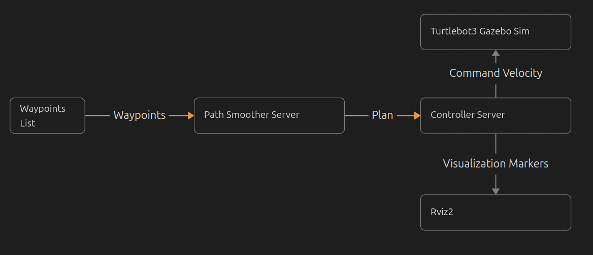

# Design Document: `smooth_path_tracker`

This document details the design, architecture, and algorithms of the `smooth_path_tracker` package, based on its implementation.

## 1. High-Level Architecture

The system is composed of two main ROS2 nodes that form a pipeline:

1.  **`path_smoother_node`**: Generates a smooth, timed path from a set of coarse waypoints.
2.  **`path_tracker_node`**: Follows the generated path using a pure pursuit-like control strategy.

These nodes are launched together using the `path_follower.launch.py` launch file, which also starts RViz for visualization. A non-ROS class, `PathProcessor`, encapsulates the core path smoothing and time-parameterization logic.

### Node Communication

-   `path_smoother_node` -> `path_tracker_node`: The smoothed path is published on the `/smooth_path` topic as a `nav_msgs/msg/Path`. This is a transient local topic, so the last published path is latched for late-joining subscribers.
-   `path_tracker_node` -> Robot: Velocity commands are published on the `/cmd_vel` topic as `geometry_msgs/msg/TwistStamped`.
-   Robot -> `path_tracker_node`: The robot's odometry is received on the `/odom` topic as a `nav_msgs/msg/Odometry`.

  

## 2. Core Components and Algorithms

### 2.1. `PathProcessor` Class (Path Smoothing and Time Parameterization)

This class is the computational core of the path generation process. It is ROS-independent.

#### Path Smoothing Algorithm: Cubic Bezier Splines

The smoothing is achieved by constructing a C1-continuous path from a series of cubic Bezier curves that pass through the given waypoints.

1.  **Control Point Calculation**: To ensure C1 continuity (smooth transitions between segments), the control points for each Bezier segment are calculated based on the surrounding waypoints. The `calculate_control_points` method implements this by solving a tridiagonal system of linear equations using the **Thomas Algorithm** (a simplified form of Gaussian elimination). This ensures that the tangent at the end of one curve segment matches the tangent at the start of the next.
2.  **Path Discretization**: The `generate_smooth_path` function iterates through the Bezier curve segments. Each segment is discretized into a series of points. The density of these points is controlled by the `points_per_meter` parameter, which provides a uniform distribution of points along the path's arc length.
3.  **Cubic Bezier Formula**: The `cubic_bezier` function calculates the position of a point on the curve using the standard formula:
    `B(t) = (1-t)^3 * P0 + 3(1-t)^2 * t * P1 + 3(1-t) * t^2 * P2 + t^3 * P3`

#### Time Parameterization

The `generate_timed_path` function takes the smoothed path (a series of points) and assigns a timestamp to each pose.

-   **Velocity**: It uses a `desired_velocity` parameter to calculate the time it should take to travel between consecutive points.
-   **Yaw Calculation**: The orientation (yaw) of each pose is calculated from the vector between the current point and the next, ensuring the robot is always oriented along the path.

### 2.2. `path_smoother_node`

This node serves as the entry point for path generation.

-   **Waypoints**: It retrieves a flat list of 2D waypoints from the ROS parameter server (e.g., `[x1, y1, x2, y2, ...]`).
-   **Path Generation**: On startup, a timer triggers the `generate_and_publish_path` function. This function uses the `PathProcessor` to convert the waypoints into a smooth, timed `nav_msgs/msg/Path`.
-   **Publication**: The resulting path is published once on the `/smooth_path` topic. It also publishes markers to visualize the original coarse waypoints in RViz.

### 2.3. `path_tracker_node` (Path Following)

This node is responsible for generating velocity commands to make the robot follow the path.

#### State Machine

The node operates using a simple state machine to manage its behavior:

-   `IDLE`: The initial state. The robot is stationary. The node does nothing until a path is received.
-   `APPROACHING`: A path has been received. The robot's goal is to get close to the first waypoint of the path. It transitions to `TRACKING` once the robot is within the `lookahead_distance` of the first point.
-   `TRACKING`: The main path-following state. The robot uses the pure pursuit algorithm to follow the path. It transitions back to `IDLE` when the goal is reached.

#### Control Algorithm: Pure Pursuit

The core of the `control_loop` is a [pure pursuit-like algorithm](https://www.ri.cmu.edu/pub_files/pub3/coulter_r_craig_1992_1/coulter_r_craig_1992_1.pdf).

1.  **Find Lookahead Point**: The `find_lookahead_point` function searches along the path to find a target point that is approximately `lookahead_distance` away from the robot's current position.
2.  **Calculate Curvature**: The algorithm calculates the required steering angle to intercept the lookahead point. The angular velocity is proportional to the angle between the robot's current heading and the lookahead point.
3.  **Velocity Commands**:
    -   **Angular Velocity**: Calculated to steer the robot towards the lookahead point.
    -   **Linear Velocity**: Set to `max_linear_velocity`, but with a key safety check: if the yaw error (the angle to the lookahead point) exceeds `yaw_error_threshold`, the linear velocity is set to zero, forcing the robot to perform an **in-place rotation** to align itself with the path before moving forward.
4.  **Goal Check**: The node continuously checks the distance to the final point on the path. If this distance is less than `goal_tolerance`, the robot stops, and the state transitions to `IDLE`.

## 3. Parameters

The behavior of the nodes is controlled by ROS parameters, loaded from `config/params.yaml`.

### `path_smoother_node` Parameters

-   `desired_velocity`: The target speed for the time parameterization of the path.
-   `points_per_meter`: The resolution of the smoothed path.
-   `waypoints`: A flattened list of [x, y] coordinates for the coarse path.

### `path_tracker_node` Parameters

-   `lookahead_distance`: The distance ahead of the robot to find the target point. A larger value results in smoother, but less accurate, tracking.
-   `max_linear_velocity`: The maximum linear speed of the robot.
-   `goal_tolerance`: The distance at which the robot is considered to have reached the goal.
-   `yaw_error_threshold`: The heading error at which the robot will stop and rotate in place.
-   `prediction_horizon`: Used for visualizing the local plan.

## 4. Visualization

The package provides several visualization markers published to RViz:

-   `/waypoint_markers`: The original coarse waypoints.
-   `/smooth_path`: The final smoothed path.
-   `/lookahead_point`: The current target point for the pure pursuit controller.
-   `/local_plan`: A visualization of the robot's predicted trajectory.
-   `/tracking_state_marker`: Displays the current state (`IDLE`, `APPROACHING`, or `TRACKING`).

